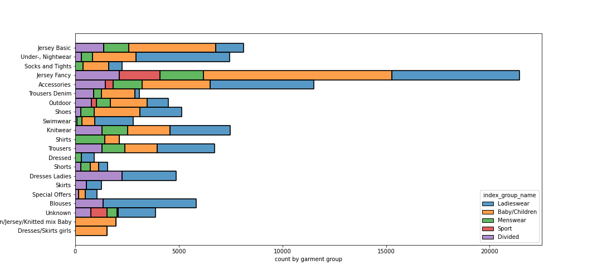

# *Fashion Recommender: Using H&M to Build a Recommendation System for Exsiting customers and New customers*
Author: [Alice Agrawal](https://www.linkedin.com/in/alice-agrawal/)

## Background of H&M
Founded in 1947, Swedish clothing retailer Hennes & Mauritz AB (STO: HM-B), commonly known as H&M, has grown into one of the most recognizable brands in the fashion industry. H&M has more than 5,000 stores worldwide and employs 120,000 people. H&M is a leader in the "fast fashion" space, competing with Zara and Forever 21.

The secret to the success of H&M and its rivals like Zara and Forever 21 can be attributed to the fast-fashion business model. Fast fashion relies on moving a large volume of merchandise from the designer table to the showroom floor in the shortest amount of time possible and at a reasonable price. Aimed at young, fashion-conscious urban consumers, their products are trendy and they're cheap, bordering on disposable.

## Business Objective
Not surprisingly, the COVID-19 shutdown had an impact in 2020. The company reported overall sales down by 5% in September 2020 over the same period one year earlier. However, H&M already had a relatively high degree of e-commerce penetration, and post-pandemic the shift to online has been notable.

In an article, the company said it would permanently shut down 350 stores starting in 2021, but that doesn't mean it's giving up on brick-and-mortar. Its executives seem to have concluded that the real world and the online world work best in tandem. "More and more customers started shopping online during the pandemic, and they are making it clear that they value a convenient and inspiring experience in which stores and online interact and strengthen each other," said CEO Helena Helmersson. "We are increasing digital investments, accelerating store consolidation, and making the channels further integrated."

With the online channels growing, H&M could use quality recommendation systems and boost their sales by targeted marketing. Promoting and making the online shopping experience more pleasant will help the brand spend lower in-store costs, and inventory, and a final huge plus for the advocacy of online shopping is the convenience. 

Ultimately this plays into the collection of more purchases and customer data which, in turn, can attribute to better-performing recommendations for each customer. A quality recommendation system can thus create a positive feedback loop that not only enhances itself but promotes an increase in article sales across the board.

Source: [https://www.investopedia.com/articles/investing/041216/hm-secret-its-success.asp](https://www.investopedia.com/articles/investing/041216/hm-secret-its-success.asp)

## Business Problem
The team of Data Scientists for H&M AI Exploration has hired me to build a recommender system for their e-commerce website to help the customer have a more personalized shopping experience. After Covid-19, they want to expand their online customer base and wish to do that by improving their algorithm. 

## Overview
The project aims to build a two-system approach to recommending H&M's articles (clothes, accessories, cosmetics, furniture, sportswear, etc) to both existing customers and new customers looking to find similar articles. For existing customers, a collaborative approach is taken by comparing similar customer profiles based on existing articles bought by them in the past. A content-based approach is taken to recommend articles based on similar article description data and can be used by anyone.

Please see my presentation for a high-level overview of the project.

## Data
The data used for this project was part of a <a href='https://www.kaggle.com/competitions/h-and-m-personalized-fashion-recommendations'> Kaggle competition </a> hosted by the clothing company H&M.

## Methods
This project uses collaborative filtering (CF) and content-based filtering (CB) to build recommendation systems. I choose to attempt a dual approach to providing recommendations so I could address a potential cold start problem. The CF system can only be used by existing customers who have previously bought articles, while the CB system can be used by anyone looking to find articles recommendations, based on similar articles. Once customers have bought a set of articles, this new customer data can be entered into the data pipeline and the CF model is retrained to provide recommendations for these customers. For each of these approaches a function was written that can return n-recommendations for articles. These functions were then used to produce a streamlit app that can be deployed to provide quality recommendations along with the pictures of the articles.

Exploratory data analysis and visualizations are conducted on the final, cleaned data.

## Results

### The Dataset
Amongst the source files included were:
1. A table of `transactions` with column values user id, article id, and time. The transactions span approximately 2 years from 2018 to 2020.
2. A table of each clothing `article` and their metadata including department name, index group name, and product descriptions.
3. A collection of product `images` for almost all of the items appearing in the transaction.



The only user-item interactions included in the data are the transactions. Thus user-item interactions are binary: 1 if the user bought an item, 0 otherwise. In particular, we cannot distinguish between the following 2 scenarios:
1. A user saw a given item, but did not like it enough to buy it.
2. A user did not see a given item, therefore did not buy it.

This presented a challenge for me in the sense that traditional collaborative filtering methods are best suited for user-item interactions which span a range of values, e.g. IMDB movie ratings 1-5, Amazon product scores 1-5 stars, Apple App Store ratings 1-5, etc. 

Since we cannot distinguish between "user did not like the item" versus "user did not see the item", this makes it very challenging to evaluate any machine learning models we build. For example, let's suppose we tried to build a machine learning model which tries to make the following prediction: Given user U and item I, what is the probability user U would buy the item I?
To train such a model, we would need to provide the machine 3 things:
1. A class of positive examples (a set of (user, item) pairs where the user bought the item).
2. A class of negative examples (a set of (user, item) pairs where the user saw the item but did not buy the item).
3. A class of "missing" examples (a set of (user, item) pairs where the users never saw the item).

The machine would then train on the data from 1 and 2, then uses the results to make predictions on 3. We can evaluate how well the machine is doing by setting aside a validation set consisting of a mix of examples from 1 and 2, and seeing how accurately the machine can predict on this validation set.

Notice that such an approach is not feasible for me: our data does not distinguish between the 2 and 3 mentioned above. So to make a collaborative filtering recommender model with this data, we assume 2 and 3 to be a single group i.e. all items are seen by the customer and they bought some articles and did not buy some articles. 

Collaborative filtering recommender systems have a drawback in that they can only recommend items that have been bought (reviewed) and the customer (user) had to have bought an article in the past. This would lead to a cold start problem. New customers and articles would not work in the collaborative filtering model. For these reasons, the Content-based filtering recommender model was also built. 

### Modeling

#### Collaborative Filtering:
The CF system was based on customer transaction data to create 'user profiles' which could then be compared with one another. Similar users, based on prior transactions/purchases, were then used to return the top-recommended articles by predicting an estimated rating (estimated purchase between 0 and 1). This approach is known as user to user. I iterated through several model algorithms and grid searches before settling on my final model (tuned SVD). This model achieved my lowest Root Mean Squared Error, coming in at 0.0115 ratings (RMSE).

Add image

The CF system function takes in a Customer's unique Customer ID and returns n-recommendations based on their profile in comparison to other users. This is demonstrated below. As one can see the CF system returns a variety of articles and is based on prior purchased articles from the customers.

Add image

For a more in-depth look at this process please see my Collaborative Filtering [notebook](https://github.com/aliceagrawal/HM-Recommender-System-App/blob/main/H%26M-CollaborativeFilteringModeling.ipynb).

#### Content Based:
The CB system was based on article description data for each article in the dataset. I included only the garment group name, product group name, and broadest division-index group name as part of the metadata for the content. 

After modeling, the created function takes in an article ID and n number of recommendations, provided by the customer and returns article recommendations. As expected from a CB system returned recommendations follow group divisions.

For a more in-depth look at this process please see my Content-Based [notebook](https://github.com/aliceagrawal/HM-Recommender-System-App/blob/main/H%26M-ContentBasedFilteringModeling.ipynb).

### App Development
To achieve real-world access to the two recommendation systems developed above I created an application intended for deployment utilizing streamlit. This app incorporated both functions created for the collaborative filtering and content-based system. Relevant data needed for the app was saved and pushed to GitHub and can be found in the Data folder.

Deployment of the app was inhibited by the maximum memory that is allocated to free streamlit accounts. Given the inclusion of both recommender systems the developed app needs over 2GB of virtual memory to run. It can however be run locally by anyone who would like to fork and download this GitHub repository. Once downloaded the appropriate environment can be activated using the requirements.txt file and then the app can be run locally by utilizing streamlit. In a local terminal type 'streamlit run app.py', which will open the application within localhost. A demonstration video of the app can be seen below.

Add a demonstration video of the app

The code for the app can be found [here](https://github.com/aliceagrawal/app.py).

## Conclusions
The recommendation system is quite good. It's able to provide a variety of recommendations that include articles for existing customers and new customers as well. Given the number of results within the scope of the provided customer ID or the article ID, there's a strong likelihood a customer would be able to purchase an article from the list of recommendations. 

## Limitations
More data about which articles the customer viewed and decided not to buy vs what the customer hasn't seen will help improve our model immensely. With more computational power, KNN algorithms could also be explored for our dataset. 

## Next Steps
Should this project be continued, the following next steps could be explored:
- Expanding the data with data about the articles viewed by the customer
- Amazon as host for app deployment
- Using the models for targeting marketing and further improving the model regularly with new data collected. 

## For More Information
Please review the full analysis in my [Collaborative Filtering Jupyter Notebook](./H&M-CollaborativeFilteringModeling.ipynb), [Content Based Filtering Jupyter Notebook](./H&M-ContentBasedFilteringModeling.ipynb) or [presentation deck](./project_presentation.pdf).

For additional questions, feel free to [contact me](mailto:alice.agrawal30@gmail.com).

## Repository Structure
```
├── Data                                      <- Source data .csv files
├── Images                                    <- Exported Notebook visualizations and images from the web
├── Model                                     <- Pickled Models
├── README.md                                 <- Top-level README for reviewers of this project
├── environment.yml                           <- Environment .yml file for reproducibility
├── EDA and Data Cleaning.ipynb               <- Technical and narrative documentation in Jupyter Notebook about the data
├── FinalDataPreparation.ipynb                <- Technical and narrative documentation in Jupyter Notebook about the data preparation for modeling
├── H&M-CollaborativeFilteringModeling.ipynb  <- Technical and narrative documentation in Jupyter Notebook about Collaborative filtering modeling
├── H&M-ContentBasedFilteringModeling.ipynb   <- Technical and narrative documentation in Jupyter Notebook about content-based filtering modeling
├── project_presentation.pdf                  <- PDF version of project presentation
├── app.py                                    <- Technical documentation of the app
└── requirements.txt                          <- Requirements .txt file for reproducibility
```

